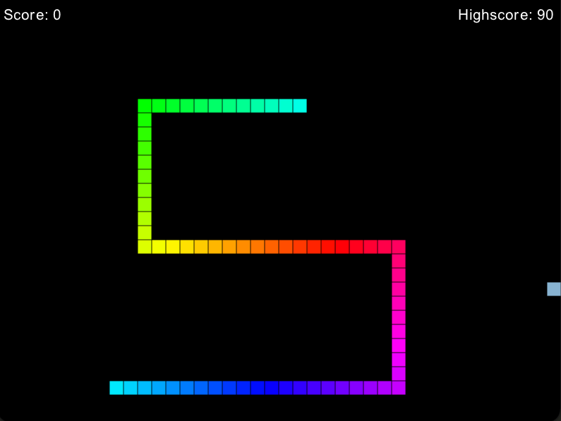

# Snake clone

### Dependencies

This project is built using [Gosu](https://www.libgosu.org/ruby.html), available as a ruby gem. Gosu is built on top of SDL2, a C library, so you will need this installed too. Please see [Gosu's wiki](https://github.com/gosu/gosu/wiki) for how to install Gosu's dependencies.

Please see the [Gemfile](Gemfile) for the gems this directly depends on.

I recommend installing those gems using [Bundler](https://bundler.io/guides/getting_started.html)

### Starting The Game

If you have used bundler, then execute `bundle exec ruby snek_game.rb`, otherwise `ruby snek_game.rb`.

Tested with `ruby 3.0.3p157 (2021-11-24 revision 3fb7d2cadc) [arm64-darwin21]`
